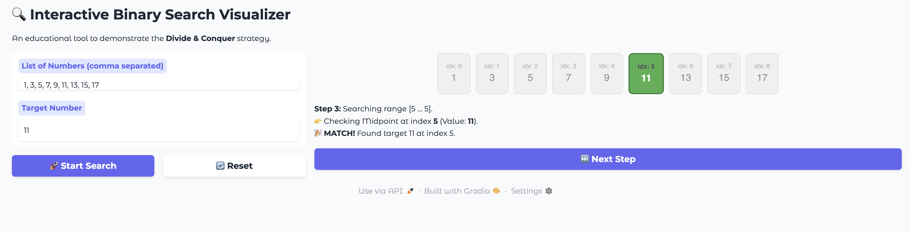
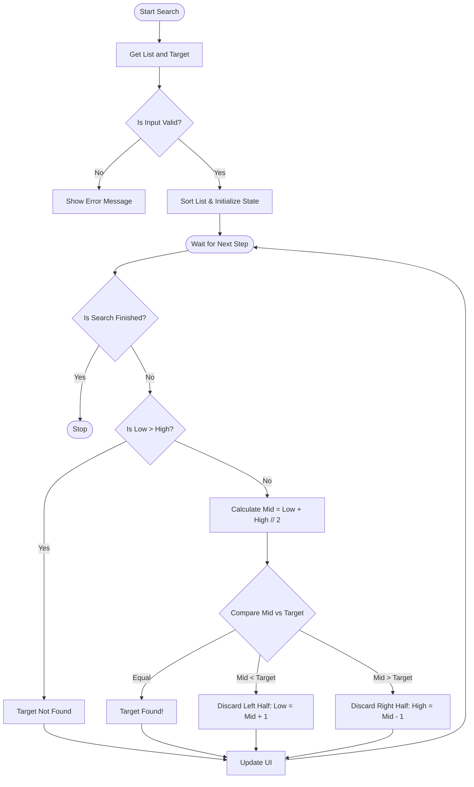
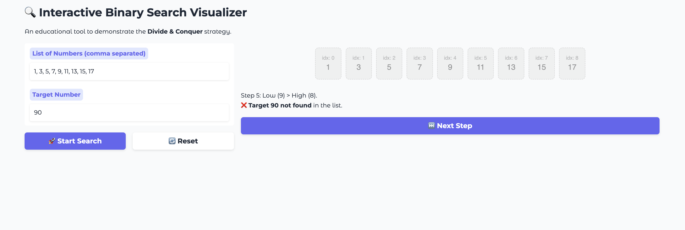

# 1. Title and Short Description
### Binary Search Visualizer
This project is an interactive web application that visually simulates the **Binary Search** algorithm. Built using **Python** and the **Gradio** UI library, it is designed to help students understand the "Divide and Conquer" strategy by animating how the search space is repeatedly halved until a target value is found.

---

# 2. Demo Screenshot or GIF
Below is the application in action, successfully finding the target value **11**.


*Figure 1: The algorithm running on a sorted list.*

### How to Read the Visualization
To make the algorithm easy to follow, I have used a specific color legend:
* **⬜ White:** **Active Range** (The candidate pool where the target might be).
* **🟨 Yellow:** **Current Midpoint** (The number currently being compared to the target).
* **⬜ Grey:** **Discarded** (Elements proven impossible, so we ignore them).
* **🟩 Green:** **Target Found!** (Success).

---

# 3. Algorithm Name and Overview
I have chosen to implement the **Binary Search** algorithm.

**Overview:**
Binary search is an efficient method for finding an item from a sorted list of items. It works by repeatedly dividing in half the portion of the list that could contain the item, until you've narrowed down the possible locations to just one.

**Time Complexity & Efficiency:**
* **Binary Search:** Runs in **$O(\log n)$** time. Because it discards half the list at every step, it is exponentially faster than linear methods for large datasets.
* **Linear Search:** Runs in **$O(n)$** time.
* **Visual Difference:** This app demonstrates this efficiency visually—you will see the "active range" cut in half with every single step, proving how fast it discards impossible values.

**Real-World Applications:**
Understanding this algorithm is crucial because it powers many real-world systems:
* **Database Indexing:** Finding a specific record among millions.
* **Dictionaries:** Quickly locating a word in a sorted physical or digital book.
* **Debugging:** Tools like `git bisect` use binary search to find the specific commit that introduced a bug.

---

# 4. Problem Breakdown & Computational Thinking
To translate the abstract logic of Binary Search into this interactive tool, I applied the four pillars of computational thinking:

### Decomposition
I broke the algorithm down into distinct stages that map directly to the code components:
1.  **Input & Validation:** Parsing the comma-separated string, converting to integers, and handling errors (e.g., empty input).
2.  **Initialization:** Sorting the list and setting initial pointers (`low`, `high`, `mid`).
3.  **Calculation:** Computing the midpoint: $mid = (low + high) // 2$.
4.  **Comparison:** Evaluating if `arr[mid]` is equal to, less than, or greater than the target.
5.  **Termination:** Deciding whether to return a success index, discard a half, or declare the item "not found".

### Pattern Recognition
The algorithm relies on a repeating pattern that occurs regardless of list size:
> *Calculate Mid $\rightarrow$ Compare to Target $\rightarrow$ Discard Half $\rightarrow$ Repeat.*

In my app, the **"Next Step"** button triggers exactly one iteration of this pattern. This reinforces the concept of a loop, and the user sees the new midpoint highlighted and half the list faded on every click.

### Abstraction
I consciously chose what to show and what to hide to avoid overwhelming the user:
* **Shown (User Model):** The list of numbers, the "active window" (white boxes), and simple text explanations (e.g., "Target is larger, go right").
* **Hidden (System Model):** The technical details of string parsing, index arithmetic, and `try/except` error catching.

### Algorithm Design
The application follows a strict **Input $\rightarrow$ Process $\rightarrow$ Output** flow.

* **Input:** User enters a comma-separated list and a target value.
* **Processing:** The app executes binary search steps using the stored state (`low`, `high`, `mid`, etc.).
* **Output:** The visualization and explanation text are updated with each step.

**Session State (Gradio):**
I used a state object (`gr.State`) to remember variables between button clicks. This is necessary because without it, the app would "forget" the current step every time the user clicked "Next Step".

---

# 5. Flowchart Diagram of the Algorithm
The following flowchart illustrates the logical flow of the algorithm:





# 6. Data Types and Structures
As per the project requirements, I explicitly state the data structures used:

* **The List:** Stored as a **Python List of Integers**.
* **The Target:** Stored as a single **Integer**.
* **The Algorithm State:** Stored in a **Dictionary** passed to `gr.State`. This dictionary acts as the app's persistent memory and contains:
    * `arr`: The sorted list of integers.
    * `target`: The integer target value.
    * `low`, `high`: Integer indices defining the active search range.
    * `mid`: Integer index of the current midpoint (or `None`).
    * `found_index`: Integer index where the target was found (or `None`).
    * `step_count`: Integer counter for the number of steps taken.
    * `finished`: Boolean flag to stop the search loop.
    * `log`: String containing the history of steps for the UI display.

---

# 7. Steps to Run the App
To run this application locally on your machine:

1.  **Clone the Repository**
    ```bash
    git clone [https://github.com/Usernamecharlie/Split-Seek](https://github.com/Usernamecharlie/Split-Seek)
    cd Split-Seek
    ```
2.  **Install Requirements**
    ```bash
    pip install -r requirements.txt
    ```
3.  **Run the App**
    ```bash
    python app.py
    ```
4.  **Open in Browser**
    The terminal will provide a local URL (usually `http://127.0.0.1:7860`).

---

# 8. Testing and Verification Section
I performed extensive testing to ensure the algorithm handles standard and edge cases correctly.

| Test Case | Expected Outcome | Actual Result |
| :--- | :--- | :--- |
| **Target in Middle** | Highlight Yellow, then Green immediately. | ✅ **Success** |
| **Target at Start/End** | Algorithm should narrow down to index 0 or N-1. | ✅ **Success** |
| **Target Not Present** | `low` becomes > `high`, log says "Not Found". | ✅ **Success** (See Figure 3 below). |
| **Empty Input** | Warning message, no crash. | ✅ **Success** (See Figure 2 below). |
| **Unsorted Input** | App should sort it automatically. | ✅ **Success** (List appeared sorted in UI). |

### Evidence of Testing
Below are screenshots demonstrating the app's robustness:

| Empty Input Handling (Validation) | Target Not Found (Logic) |
| :---: | :---: |
|  <br> *Figure 2: App gracefully handling empty input.* |  <br> *Figure 3: App correctly determining target is missing.* |

---

# 9. Hugging Face Link
The application is deployed and available for immediate testing here:

👉 **[https://huggingface.co/spaces/Username3030/SPLIT\_and\_SEEK](https://huggingface.co/spaces/Username3030/SPLIT\_and\_SEEK)**

*You can test the app directly in your browser without installing any files.*

---

# 10. Author and Acknowledgment
* **Author:** Maxwell Kroll
* **Course:** CISC-121
* **Statement:** This project was completed for CISC 121 at Queen's university, for the "Python App for one Searching or one Sorting Algorithm visual simulation" assignment using Python and Gradio.
* **AI Disclaimer and Acknowledgment**
I used **ChatGPT 5.1** to significantly assist in the visualization, testing, and documentation stages of this project.

Specifically, the AI was instrumental in:
* **Visualizing Logic:** Converting the Python logic into abstract visual representations, such as drafting the initial concept for the flowchart diagram and suggesting the color-coding scheme (e.g., finding the appropriate light grey color code like `#f0f0f0` used for the array boxes). This greatly improved my efficiency and taught me how to utilize clear visual cues for future projects.
* **Workflow Optimization and Debugging:** The AI served as a powerful tool for streamlining my development workflow, providing rapid insights for general code troubleshooting and debugging. This significantly reduced non-algorithmic development time.
* **Code Troubleshooting:** Providing support for general code troubleshooting and debugging.
* **Documentation Support:** Assisting with Markdown syntax. I faced a recurring issue during the documentation phase (Step 6) where I struggled to correctly indent sub-bullet points in section 6. ChatGPT 5.1 helped identify and provide the correct Markdown syntax to achieve the complex formatting I had in mind for the `README.md`.

---

## 11. Reflection & Limitations
* **Current Limitation:** The app currently supports integer lists only.
* **Future Improvement:** Could be extended to support Strings or to compare Linear vs Binary search side-by-side.

## 12. Project Deliverables Table
| File | Description |
| :--- | :--- |
| `app.py` | Main application file containing logic and UI. |
| `requirements.txt` | List of dependencies (Gradio). |
| `README.md` | Complete documentation (this file). |
| `Screenshots` | `demo_working.png`, `test_error_handling.png`, and `test_not_found.png` for verification. |
| **Hugging Face App Link** | The deployed version of app: **https://huggingface.co/spaces/Username3030/SPLIT\_and\_SEEK**. | (Linked in Section 9). |
